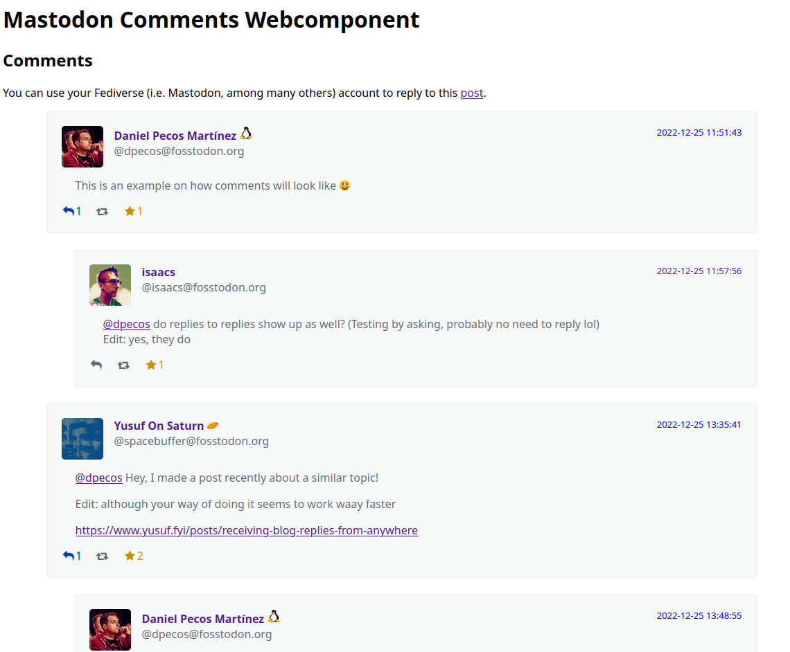

# mastodon-comments

`mastodon-comments` is a [webcomponent](https://developer.mozilla.org/en-US/docs/Web/API/Web_Components) that will embed a Mastodon toot conversation in a website.

This webcomponent is explained in detail in the [following blog post](https://danielpecos.com/2022/12/25/mastodon-as-comment-system-for-your-static-blog/), where you can see a live example as well.

## Characteristics

- Implemented as a standard web component, easy to integrate
- Lazy-loads the toot conversation, only when the component is part of the viewport

## Styling the component

These are the default values that the component exposes as CSS vars (no need to specify them if you are happy with the current values):

```css
mastodon-comments {
  --font-color: #5d686f;
  --font-size: 1.0rem;

  --block-border-width: 1px;
  --block-border-radius: 3px;
  --block-border-color: #ededf0;
  --block-background-color: #f7f8f8;

  --comment-indent: 40px;
}
```

## Example



```html
<script src="https://cdnjs.cloudflare.com/ajax/libs/dompurify/2.4.1/purify.min.js" integrity="sha512-uHOKtSfJWScGmyyFr2O2+efpDx2nhwHU2v7MVeptzZoiC7bdF6Ny/CmZhN2AwIK1oCFiVQQ5DA/L9FSzyPNu6Q==" crossorigin="anonymous" referrerpolicy="no-referrer"></script>
<link rel="stylesheet" href="https://cdnjs.cloudflare.com/ajax/libs/font-awesome/4.7.0/css/font-awesome.min.css">
```

[Example embedding a toot into a HTML](./example/index.html)
